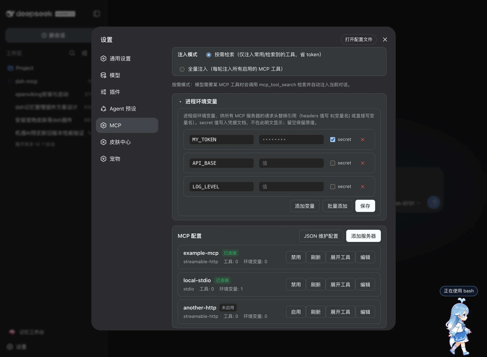

# dsh-mcp — MCP 管理界面 + tool search：稳定工具列表、命中缓存、不撑爆上下文

**[English](README.en.md) | 简体中文**

[](https://dshfind.com/zh/plugins/ArvinQi/dsh-mcp?ref=badge)

> **支持版本**：`dsh 0.1.6-alpha.2` —— 本插件在 `0.1.6-alpha.2` 上开发与验证，`package.json` → `dsh.supported` 同步声明。DSH 与插件两侧版本不匹配时，设置页会给出排查诊断（检查注册行 → 重启 `dsh web` → 硬刷新 → 同步升级）。



## 为什么用 dsh-mcp？

**解决的核心问题：**

- **MCP 工具全量注入烧 token**：接入多个 MCP 服务器后工具可达上百个，每轮全量注入开销巨大。`search` 按需检索模式让模型通过 `mcp_tool_search` 热注入所需工具，大幅节省 token。
- **工具列表反复更新破坏缓存**：`tools/list_changed` 通知会让同名工具被反复注销/重注册，系统提示词工具列表抖动、prompt cache 频繁失效。工具列表稳定化让未变化的工具保留原注册，最大化 cache 命中。
- **没有可视化管理入口**：服务器配置、启停、工具勾选全靠手工改文件。Settings → MCP 一站式可视化完成。

**功能优势：**

- **可视化管理**：服务器列表 / 新建 / 编辑 / 删除 / 测试连接 / 启停 / 刷新，全 UI 操作
- **进程级环境变量**：全局 KV 配置（默认展开、支持批量添加），服务器请求头 value 写 `变量名` 或 `${变量名}` 即可在连接时自动替换为配置值（如 `Authorization: Bearer ${TOKEN}`）
- **JSON 全量配置**：「JSON 维护配置」面板以一段 JSON 数组查看/编辑全部服务器配置，应用即保存（新增/更新/删除）
- **工具级精细控制**：每个服务器展开工具列表，默认全选，可取消勾选只加载需要的部分
- **图片结果透传**：MCP 工具返回的图片（截图/图表等）经附件服务投影为图片引用进入模型上下文，带严格预检与有界降级文案（PR #4）
- **双注入模式**：`search`（按需检索，省 token）与 `full`（全量注入）
- **零 npm 依赖**：直接对接 DeepSeek Harness 内部能力，安装即用
- **OAuth 认证支持**：`streamable-http` 服务器若走 MCP OAuth（授权码 + PKCE），连接时自动打开浏览器授权；token 与 client 信息持久化、由 SDK 自动刷新（24 小时内活跃自动续期），失效后自动重新授权
- **三种安装方式**：npm / GitHub git 源 / 本地 link；中英文界面与文档

## 功能

- **托管 MCP 服务器注册表**（host）：持久化定义（storage-domain `mcp_servers`）、按服务器挂载
  `@deepseek-ai/dsh-mcp-client` 实例、环境变量注入（明文入定义、secret 走 credentials）、
  连接探测（test）。
- **Web 设置管理页**（client）：Settings → MCP，列表/编辑/删除/测试服务器。
- **OAuth 认证**（host，`lib/oauth.js`）：`streamable-http` 服务器遇 401 + OAuth 挑战时自动走
  授权码 + PKCE 流程，打开浏览器授权、回环回调收码、token 持久化并按需自动刷新；
  测试连接与挂载共用同一份 token。
- **Remote 自挂载**：client 半部在 `apply()` 里自行 `ctx.remote.$mount()` 挂载 `mcpManager`
  命名空间（原实现依赖 api-remotes 的 in-box 修改，独立版不再需要任何 in-box 包改动）。
- **读取声明式服务器**（host，`lib/cordis-servers.js`）：把 patch 层里原生声明的
  `@deepseek-ai/dsh-mcp-client` 行一并展示到设置页（只读，见下节）。

### 声明式服务器（`cordis.patch.yml`）与优先级

DSH 原生支持在组合里直接声明 MCP 服务器：**一行一台**，`name: '@deepseek-ai/dsh-mcp-client'`，
放在 profile 级 `$DSH_HOME/profiles/<profile>/cordis.patch.yml` 或机器级
`$DSH_HOME/cordis.patch.yml`（机器级对所有 profile 生效，且按层级覆盖 profile 级同 id 行）。

```yaml
- insert:
    - id: mcp-github
      name: '@deepseek-ai/dsh-mcp-client'
      config:
        transport: stdio          # 或 streamable-http
        serverName: github
        command: npx
        args: ['-y', '@modelcontextprotocol/server-github']
```

1.11.0 起，这些声明会出现在 Settings → MCP 列表中，标记「cordis 声明」，只读展示来源文件。
规则：

- **声明优先**：同一 `serverName` 若已被 patch 层声明（且未 `disabled`），插件不再挂载存储里
  的同名行——同名双挂载会撞工具注册表并让该服务器的工具整代回滚，页面会给出冲突说明。
- **只读**：声明式服务器在本页不可启停/编辑，改配置请直接改 `cordis.patch.yml`（`web`/`desktop`
  为 live reload，改完即生效；`headless`/`sdk` 等下次启动生效）。
- **导入 storages（镜像行）**：启动与每次刷新会把声明导入存储 domain（id `cordis:<rowId>`，
  带 `origin/declaredIn/declaredRowId` 来源标记），**只导入不覆盖**——插件自建行永不被改写；
  声明消失的镜像**自动删除**（镜像只是声明的副本，无主后不应堆积）；含 `!!js` 表达式的声明**跳过导入**并在页面标注
  原因（值只能在 Loader 内求值）。镜像行**永不挂载**，挂载始终归组合。
- **接管 / 释放**：点击「接管」后，插件在 `cordis.patch.yml` 的**受管块**内写入 id-targeted `disabled: true`
  （首次写入前生成 `.dsh-mcp.bak` 备份；原子替换、幂等、可逆，只动该块），声明让出 `serverName`，改由插件挂载
  同名行——由此启用 **OAuth 授权、凭据托管、`${VAR}` 头替换、测试连接**。挂载**硬失败**会自动回滚（移除受管块、
  行退回镜像）并返回失败原因；「释放」把挂载交还声明行并删除插件行。缺少显式 `id` 或含 `!!js` 的声明不可接管。
- **OAuth / 占位符限制（`needsPlugin`）**：声明行本身既不能携带 OAuth provider，也不能解析
  `${VAR}`/裸变量名占位符——这两件事只有插件会做。因此这类声明**只能由插件挂载**：页面会把它们标为
  **挂载失败并说明原因**（不是"连接中"），「释放」会让工具消失（确认框与结果告警都会提示），恢复只需
  重新「接管」。
- **OAuth 是显式开关（1.11.1 起）**：服务器配置里的 `oauth: true`（设置页「使用 OAuth 授权」勾选，默认关）
  才会挂 OAuth provider。**用静态 token 或自定义头认证的服务器不要勾**——否则它返回 401 时会被当成 OAuth
  挑战，插件会反复打开浏览器授权（并起 `127.0.0.1:<port>/callback` 回环回调）。另外，同一服务器**每个进程
  最多自动弹一次**浏览器，之后只返回带授权链接的错误；手动「测试连接」仍可随时发起授权。升级时会按已有
  OAuth 凭据自动迁移，真正需要 OAuth 的服务器不受影响。
- **热重载未提交时的安全降级**：写入停用块后若原生工具 5 秒内没有注销（该 profile 的 patch 热重载未提交，
  例如某个兄弟条目重建失败导致整代回滚），插件会**登记接管但暂不挂载**（管理行标记 `pendingTakeover`），
  重启 dsh 后由插件挂载；「释放」在同样情况下会提示需要重启。此外，挂载前若发现同名 `mcp__<server>__`
  工具已存在且不是本插件挂载的，一律跳过——任何情况下都不会与仍在挂载的声明行争抢同名工具。
- **tool search 覆盖**：检索/热注入与单工具开关按 `mcp__` 前缀处理整个工具集，声明式服务器的
  工具天然纳入，无需额外配置。

## 结构

```
dsh-mcp/
├── package.json          name=dsh-mcp；dsh.client 声明；零 npm dependencies
├── lib/
│   ├── index.js          host 半部（McpManagerService，源自 mcp-manager 构建产物）
│   ├── cordis-servers.js 读取 patch 层原生声明的 MCP 服务器（1.11.0）
│   ├── patch-writer.js   受管块写入器：接管时在 patch 文件里停用声明行（备份/原子/幂等）
│   ├── mcp-client.js     vendored MCP 客户端（源自 @deepseek-ai/dsh-mcp-client，含工具列表稳定扩展）
│   ├── oauth.js          MCP OAuth 客户端提供者（授权码 + PKCE、回环回调、token 持久化）
│   ├── probe.js          vendored 连接探测（源自 mcp-client/src/probe.ts）
│   ├── transport.js      vendored 传输工厂（源自 mcp-client/src/transport.ts）
│   └── client.js         浏览器半部（esbuild 打包，ModuleLoader wire format）
├── src/client/           浏览器半部源码（TSX + CSS Modules + 本地 types + remote-contribution）
└── scripts/build.mjs     构建脚本（esbuild 取自 DSH checkout，见下）
```

## 构建

```sh
node scripts/build.mjs
```

- esbuild 从 DSH 源码 checkout 解析：`$DSH_SOURCE` 未设置时尝试
  `~/.dsh/source/current`。
- 运行时依赖（`@deepseek-ai/*`、`zod`、`@modelcontextprotocol/sdk`）不装 npm 包，
  从 `$DSH_HOME/profiles/node_modules`（DSH profiles 模块 fallback，`$DSH_HOME` 默认 `~/.dsh`）解析；构建时经
  `nodePaths` 指向同一目录。
- CSS Modules 由 esbuild onLoad 插件处理：样式注入
  `<style data-plugin="dsh-mcp" data-file="…">`，默认导出 identity 类名映射。

## 测试

```sh
npm test
```

- `npm test` 会自动适配环境：依赖 DSH 模块闭包（`@deepseek-ai/*`、`js-yaml`）的测试文件
  （`cordis-servers` / `patch-writer` / `takeover`）在**缺少本地 DSH 安装时会被跳过**（公共 CI
  即如此），本机（profile 的 `node_modules` 可达）则跑全量，并在输出里说明跳过了哪些文件。
- 新增依赖 DSH 闭包的测试文件时，记得加进 `scripts/test.mjs` 的 `NEEDS_DSH_CLOSURE` 列表。

## 安装使用

### 1. 安装

本插件声明了 `dsh.bundle.patch`，用 `plugin_manager` 的 `install_bundle` 指向本目录即可，
依赖写入 profile、注册行自动追加，**无需手工编辑任何配置文件**：

```text
plugin_manager { action: "install_bundle", target: "<本仓库绝对路径>" }
```

命令行等价形式（把包装进 profile，随后由 bundle 补丁自动注册）：

```sh
dsh plugin --profile web add link:<本仓库绝对路径>
```

> 注意：本地 `link:` 安装时，插件目录内含 `node_modules -> $DSH_HOME/profiles/node_modules`
> symlink（本机开发用，不入库），否则 `link:` 安装的 symlink 被 realpath 后无法解析
> `@deepseek-ai/*`。

### 2. 生效

**重启 `dsh web`**，然后**硬刷新浏览器**（`Ctrl + Shift + R`）：

> ⚠️ **重启 + 硬刷新缺一不可**：
> - 宿主半部（`mcpManager` 服务）变更必须**重启 `dsh web`**，仅刷新浏览器不够；
> - 重启后浏览器必须**硬刷新**，普通刷新可能仍使用缓存的旧页面。
>
> 已启用后再改动插件代码时：只改客户端半部（`lib/client.js`）刷新页面即可，
> 改宿主半部（`lib/index.js` 等）仍需重启。

### 3. 使用

**打开管理页**：重启后浏览器打开 DSH Web → **设置（Settings）→ MCP**，
入口位于「技能」正下方。

### 4. 常见问题排查

**Q1：安装后设置页看不到「MCP」？**

按顺序检查：

1. **是否重启了 `dsh web`**：仅刷新浏览器不够。宿主半部与 client roster 都在进程启动时装载，
   插件集变更必须**重启进程**；若插件是在进程启动之后才装进去的，重启前它一直不会激活。
2. **是否硬刷新了浏览器**：重启后用 `Ctrl + Shift + R` 强制刷新；普通 `F5` 可能加载缓存的旧页面。
3. **是否装到了正确的 profile**：确认装进了当前 profile（`web`）；装到其他 profile
   则在其他 profile 的设置页查看。
4. **依赖是否声明完整**：`@deepseek-ai/*` 的导入依赖本插件 `package.json` 的
   `peerDependencies` 声明，DSH 的模块拦截层据此决定是否路由到安装级副本。
   可用 `node tests/check-peers.mjs` 检查是否有未声明的导入。

**Q2：设置页能看到「MCP」，但服务器列表为空/报错？**

- 确认 `dsh web` 进程日志中 `mcp-manager` 没有初始化错误；
- 若升级过插件，请重启后**硬刷新**，避免旧 client bundle 与新版 host 不匹配
  （典型现象：操作报 `client api: ... 404` 或 `env is not iterable`，都是新旧版本混用所致）；
- 报错形如 `transport failure for /api/mcpManager/list: HTTP 404` 表示宿主端没有注册
  `mcpManager` 服务：多半是插件宿主半部未生效（装错 profile，或装了之后没重启 `dsh web`）
  或 client 与 host 版本不一致。请按 Q1 逐项核对，重启后硬刷新；
  仍不行则把 `dsh web` 与插件版本都升到最新再试。

**Q3：MCP 工具没有出现在 agent 会话里？**

- 确认对应服务器状态为「已连接」且工具已勾选（默认全选）；
- 注入模式为「按需检索」时，模型会通过 `mcp_tool_search` 检索后热注入，未检索到的工具不在
  系统提示词中属正常现象；可切换到「全量注入」验证。

**Q4：服务器配置了 Authorization 头却提示需要 OAuth 授权 / 挂载失败？**

- 只要在请求头里配置了 `Authorization`（静态 Bearer/token），dsh-mcp 就不会把它当作 OAuth
  服务器：真正的 OAuth（授权码 + PKCE）只对**没有静态 Authorization 头**的服务器启用，避免
  401 被误当成 OAuth 挑战而打开浏览器授权。若你连的是需要静态 token 的服务器，确认请求头
  正确即可；
- 若 https 内网域名报 `fetch failed` / `unable to verify the first certificate`，是宿主 Node
  不信任公司内网 CA：用 `NODE_OPTIONS=--use-system-ca` 启动 `dsh web`（或把根证书加入
  `NODE_EXTRA_CA_CERTS`），再重启宿主与硬刷新浏览器。

**添加服务器**：

1. 点击「添加服务器」（表单在列表上方就地展开）
2. 填写：服务器名称（`serverName`，决定工具前缀 `mcp__<serverName>__`）、传输方式
   （`streamable-http` 填 URL / `stdio` 填命令）、请求头、工具调用超时等
3. 点「测试连接」确认连通性与工具列表，点「保存」

**进程环境变量**（注入模式下方，默认展开）：

- 配置全局键值对，供所有服务器的请求头替换引用；secret 值写入凭据文档，留空保留原值
- **process.env 优先**：若变量在进程环境变量（`process.env`）中已存在同名值，连接/展示时直接采用该值（不改名），
  存储值仅作为兜底——请先在启动脚本里 `export ADA_TOKEN=...` 再重启 `dsh web`
- 支持「批量添加」（粘贴多行 `NAME=value`；带值的行默认按 secret 添加，可在保存前取消勾选）与「添加变量」逐行添加
- 服务器请求头 value 可直接写**变量名**或 **`${变量名}`**（如 `Authorization: Bearer ${GITLAB_TOKEN}`），
  连接时自动替换（优先级：服务器 env > 进程级 env > 系统环境变量）

**JSON 维护配置**（MCP 配置模块右上角）：

- 以一段 JSON 数组查看/编辑**全部服务器配置**；应用后按列表全量替换（新增/更新/删除），
  自动刷新列表与工具列表；JSON 面板展开时隐藏 UI 列表，应用后恢复
- 服务器级 env（含 secret 标记与 stdio 子进程注入）仍通过 JSON 配置维护

**OAuth 服务器**（`streamable-http` 走 MCP OAuth，如受 OAuth 保护的网关服务）：

- 只需正常填写 URL 并测试连接；服务器返回 401 + OAuth 挑战时，插件**自动打开浏览器**完成授权
- 在浏览器中登录/同意后返回 DSH，测试结果自动刷新（「连接成功 + 工具数」）
- token 与 OAuth client 信息持久化在凭据文档（按 `serverName` 隔离），由 MCP SDK 自动刷新
  （24 小时内活跃自动续期）；失效后自动重新授权，授权一次后挂载与测试复用
- 首次授权需浏览器交互，测试/连接等待时间放宽至 5 分钟；非 OAuth 服务器不受影响，连接失败即时返回

**日常管理**：

- **启用 / 禁用**：列表行按钮，禁用后该服务器所有工具即时注销，不再注入
- **刷新**：重新拉取服务器状态与工具列表（服务器重启后可同步新工具）
- **测试连接**：编辑页可随时测试

**工具控制（省 token 的关键）**：

- **注入模式**：页面顶部切换 `search`（按需检索，默认）或 `full`（全量注入）
  - `search` 模式下，模型需要某 MCP 工具时调用 `mcp_tool_search` 检索并热注入当前对话
- **工具勾选**：点「展开工具」查看该服务器全部工具（默认全选），取消勾选 = 不注入该工具，
  即时生效，无需保存

**验证效果**：

- 在任意 agent 会话中，可用工具应包含 `mcp__<服务器名>__<工具名>`
- `search` 模式下未检索到的工具不占系统提示词，节省 token 并提升 prompt cache 命中率
- 工具内容未变化时，`list_changed` 通知不会反复注销/重注册同名工具，工具列表保持稳定

## 版本注意

- host 半部 `lib/index.js` 是 mcp-manager 的**构建产物**（spec/types 已内联），改动请直接编辑
  lib 下文件，或改回 TS 后重新用仓库工具链构建。
- 浏览器半部改 `src/client/*` 后重新 `node scripts/build.mjs`；host 半部改动无需重装
  （link 安装直接生效）。
- 配置变更（bundles 增删、新插件行）需重启 `dsh web` 才进入 client roster。
- **每次发版都必须声明支持的 DSH 版本**：在 CHANGELOG 对应条目与 GitHub Release notes 里加一行
  `- **支持版本**：dsh <版本>`，并同步更新 `package.json` 的 `dsh.supported` 与 README 顶部的「支持版本」。

[](https://dshfind.com/zh/plugins/ArvinQi/dsh-mcp?ref=badge)
